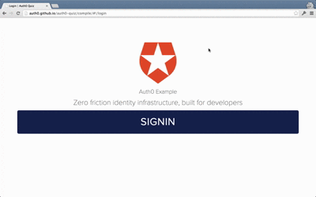

## AngularJS configuration

Please follow the steps below to configure AngularJS to use it with Auth0.

### 1. Adding the Auth0 scripts

````html
<!-- We use client cookies to save the user credentials -->
<script src="//code.angularjs.org/1.2.16/angular-cookies.min.js"></script>
        
<!-- Auth0 widget script and AngularJS module -->
<script src="//cdn.auth0.com/w2/auth0-widget-4.js"></script>
<script src="//cdn.auth0.com/w2/auth0-angular-0.4.js"> </script>
````

We're including Auth0's angular module and its dependencies to the `index.html`. 

### 2. Add the module dependency and configure the service

First, you need to add the `auth0` module dependency to your angular app definition. Then, you need to configure it by calling the `init` method of the `authProvider`

````js
// app.js
angular.module('YOUR-APP-NAME', ['auth0'])
.config(function (authProvider) {
  authProvider.init({
    domain: '@@account.namespace@@',
    clientID: '@@account.namespace@@',
    callbackURL: '@@account.callback@@'
  });
});
````

### 4. Let's add routing (Optional)

In most cases, we'll have routing in our app. So let's add the `$routeProvider` configuration in the `config` method of our app.

````js
// app.js
.config(function (authProvider, $routeProvider) {
  $routeProvider.when('/login', {
    templateUrl: 'login.tpl.html', 
    controller: 'LoginCtrl'
  });
  // Logged in route
  $routeProvider.when('/user-info', {
    templateUrl: 'userInfo.tpl.html', 
    controller: 'UserInfoCtrl',
    requiresLogin: true
  });
});
````

We need to set the `requiresLogin` property to true for all routes that require the user to be logged in.

__Note__: If you are using ui-router, all you have to do is to create states instead of the routes above and set the `requiresLogin` attribute inside the `data` property of the state.

### 5. Let's implement the login

Now we're ready to implement the Login. We can inject the `auth` service in any controller and just call `signin` method to show the Login / SignUp popup. In this case, we'll add the call in the login method of the controller.

````js
// LoginCtrl.js
$scope.login = function() {
  auth.signin({
    popup: true
  });
}
````

````html
<!-- login.tpl.html -->
<!-- ... -->
<input type="submit" ng-click="login()" />
<!-- ... -->
````

If you want to check all the available arguments for the signin call, please [check here](TODO://)



#### 6. Handling Login success and failure

The `signin` method returns a promise. That means that we can handle login success and failure the following way:

````js
// LoginCtrl.js
$scope.login = function() {
  auth.signin({
    popup: true
  })
  .then(function() {
    // Success callback
  }, function() {
    // Error callback
  });
}
````

#### 7. Adding a logout button

You can just call the `signout` method of Auth0 to remove all the cookies from the client that keep the user logged in:

````js
$scope.logout = function() {
  auth.signout();
}
````

````html
<input type="submit" ng-click="logout()" value="Log out" />
````

#### 8. Showing user information

After the user has logged in, we can get the `profile` property from the `auth` service which has all the user information:

````html
<span>His name is {{auth.profile.nickname}}</span>
````

````js
// UserInfoCtrl.js
function UserInfoCtrl($scope, auth) {
  $scope.auth = auth;
}
````

You can [click here](https://docs.auth0.com/user-profile) to find out all of the available properties from the user's profile. Please note that some of this depend on the social provider being used.

#### 9. Sit back and relax

Now it's time to sit back, relax and open a beer. You've implemented Login and Signup with Auth0 and AngularJS.

#### Extra Extra

We've learnt how to configure AngularJS with Auth0's module and a popup for Signing in.

If you want to learn how to implement this with redirect, [you can read here](https://github.com/auth0/auth0-angular/blob/master/docs/widget.md)

If you want to implement your custom Signin and Signup form, [you can read here](https://github.com/auth0/auth0-angular/blob/master/docs/jssdk.md)


